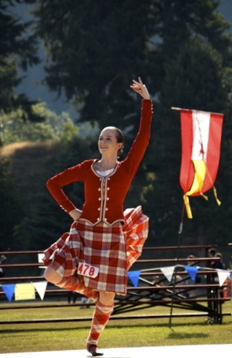

# Hello and welcome!

My name is Quinn, and I’m a Highland dance teacher. Highland dance is an art form originating in Scotland as early as the 15th century. Dancers wear kilts, velvet jackets, and other accessories, and dancers of all genders are welcome. Today, Highland dance is typically showcased at Highland games, where dancers compete as individuals. Highland dance is also often included in local performances for Scottish cultural events and community events.

As a teacher, I strive to create a body-positive space in which dancers can connect with each other, work toward the goals that they set for themselves, and grow as a dancer, individual, and artist. In my studio, I welcome dancers of any age, skill level, and identity.

**Curious to know more?** Please fill out a contact form, and I’ll be in touch with you shortly.

  
  

